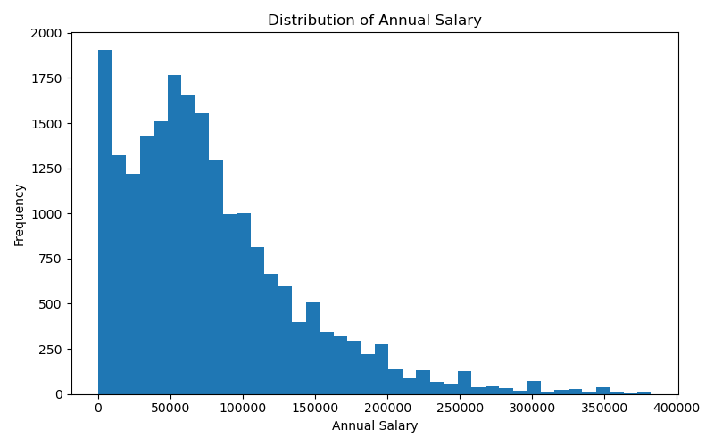
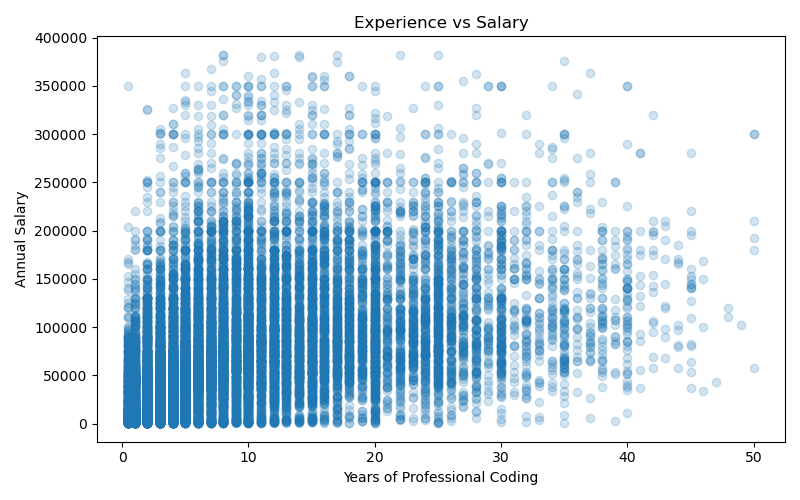
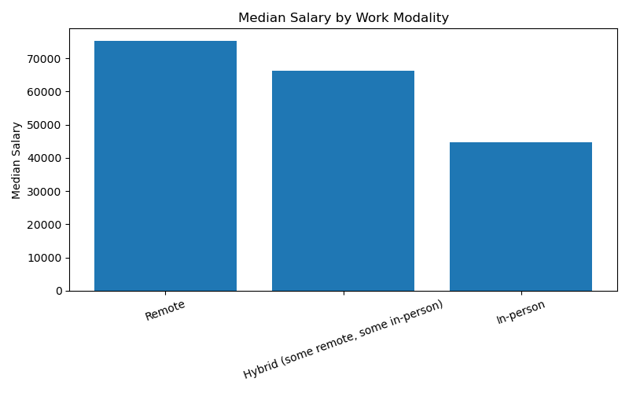
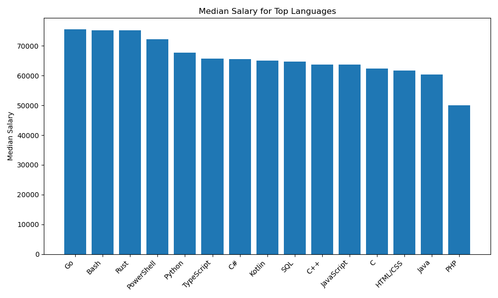
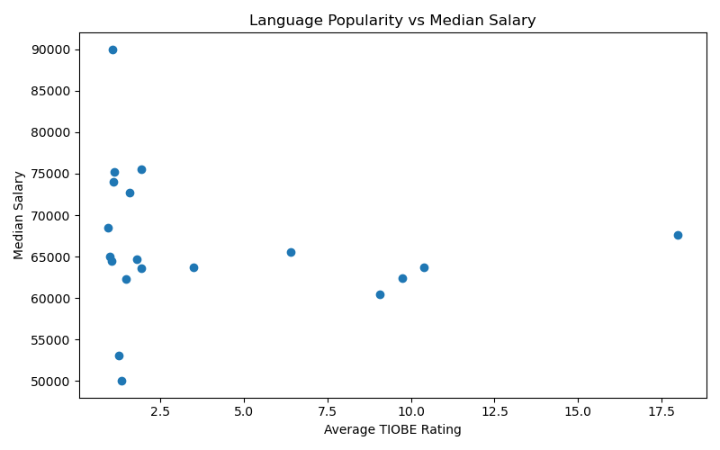

## A Data-Driven Analysis of Developer Salaries:  What Makes a Developer Earn More? 
---

## 1. Project Motivation

In today’s software industry, developers often question which skills and conditions lead to higher salaries. While some believe that choosing popular programming languages leads to better compensation, others argue that structural factors such as experience and work conditions are more important.

**The goal of this project is to move beyond intuition and analyze developer salaries using real-world data.** By building a full data science pipeline—from data collection and cleaning to statistical hypothesis testing—this project aims to uncover the key drivers behind salary differences.

---

## 2. Data Pipeline & Methodology

### 2.1 Data Sources

* **Stack Overflow Developer Survey 2024**
  → Provides individual-level data (salary, experience, languages, work type)

* **TIOBE Index 2024**
  → Provides external data on programming language popularity

### Processed Data

Due to GitHub file size limitations, sampled versions of the processed datasets are included in this repository.

Full processed datasets are available here:
https://drive.google.com/drive/folders/1eua8dMro7d876svTu6Q2K29K2r_s9xxO?usp=sharing
---

### 2.2 Data Cleaning & Preparation

To ensure reliable analysis, the dataset was carefully preprocessed:

* Filtered only **employed developers**
* Removed missing and invalid salary values
* Removed extreme outliers (1st–99th percentile)
* Converted experience into numeric format
* Applied **log transformation** to normalize salary distribution

---

### 2.3 Data Enrichment

To incorporate market-level information:

* Collected 12 months of TIOBE data
* Computed yearly average popularity scores
* Merged popularity data with developer-level dataset

This step allows us to analyze whether **language popularity affects salary**.

---

## 3. Exploratory Data Analysis (EDA)

### 3.1 Salary Distribution

*Objective: Understand how salaries are distributed.*



**Insights:**

* Salary distribution is highly **right-skewed**
* A small number of developers earn significantly higher salaries
* Log transformation improves interpretability

---

### 3.2 Experience vs Salary

*Objective: Examine relationship between experience and salary.*



**Insights:**

* Salary generally increases with experience
* However, there is high variance across all experience levels

---

### 3.3 Remote vs In-Person Work

*Objective: Compare salaries based on work modality.*



**Insights:**

* Remote and in-person work show clear differences in salary distribution
* Work modality appears to influence compensation

---

### 3.4 Programming Languages and Salary

*Objective: Compare salaries across languages.*



**Insights:**

* Some languages consistently have higher median salaries
* Language choice plays a significant role in earnings

---

### 3.5 Popularity vs Salary

*Objective: Analyze relationship between popularity and salary.*



**Insights:**

* No clear relationship between popularity and salary
* Some less popular languages still have high salaries

---

## 4. Statistical Hypothesis Testing

To validate the findings from exploratory data analysis, formal statistical tests were conducted.

---

### Test 1: Salary Differences Across Programming Languages (ANOVA)

- **Null Hypothesis ($H_0$):** There is no significant difference in mean salaries across programming languages.  
- **Alternative Hypothesis ($H_1$):** At least one programming language has a significantly different mean salary.  

- **Test Used:** One-way ANOVA  
- **Result:** p < 0.001  

**Conclusion:**  
The null hypothesis is rejected. Salaries differ significantly across programming languages, indicating that language choice is an important factor in salary determination.

---

### Test 2: Remote vs In-Person Work (Welch t-test)

- **Null Hypothesis ($H_0$):** There is no difference in mean salaries between remote and in-person workers.  
- **Alternative Hypothesis ($H_1$):** There is a significant difference in mean salaries between remote and in-person workers.  

- **Test Used:** Welch Two-Sample t-test  
- **Result:** p < 0.001  

**Conclusion:**  
The null hypothesis is rejected. Work modality (remote vs in-person) has a statistically significant impact on salary.

---

### Test 3: Programming Language Popularity vs Salary (Spearman Correlation)

- **Null Hypothesis ($H_0$):** There is no correlation between programming language popularity and salary.  
- **Alternative Hypothesis ($H_1$):** There is a significant correlation between programming language popularity and salary.  

- **Test Used:** Spearman Rank Correlation  
- **Correlation Coefficient:** -0.27  
- **p-value:** 0.26  

**Conclusion:**  
The null hypothesis cannot be rejected. There is no statistically significant relationship between programming language popularity and salary.

---

### Overall Interpretation

The statistical results show that while programming language choice and work modality significantly influence salaries, programming language popularity does not have a meaningful effect. This suggests that structural factors play a more important role in salary determination than market popularity.

---

## 5. Key Findings

* Programming language choice has a **significant impact** on salary
* Remote work is a **significant factor** in salary differences
* Programming language popularity does **not significantly affect salary**

---

## 6. Interpretation

The results show that **structural factors**, such as experience and work conditions, play a much larger role in determining salary than programming language popularity.

Although popular languages dominate the market, they do not necessarily provide higher earnings.

This suggests that **real-world compensation is driven by demand, specialization, and context rather than popularity metrics alone.**

---

## 7. Project Structure

```
dsa210_salary_project/
│
├── Developer_Salary_Analysis.ipynb   # Main notebook (EDA + interpretation)
├── src/                              # Python scripts (pipeline)
├── data/                             # Raw and processed datasets
├── outputs/                          # Generated figures and tables
├── requirements.txt
├── README.md
```

---

## 8. How to Run

1. Install dependencies:

```bash
pip install -r requirements.txt
```

2. Run the analysis:

```bash
python src/salary_analysis.py
```

3. Open the notebook:

```bash
jupyter notebook Developer_Salary_Analysis.ipynb
```

---

## 9. Outputs

All generated outputs are saved in:

```
outputs/figures/
outputs/tables/
```

---

## 10. Conclusion

This project demonstrates that developer salaries are shaped primarily by structural and contextual factors, rather than programming language popularity.

While language choice matters, popularity alone is not a reliable predictor of compensation.

---
---

## Academic Integrity

This project is an original work created for the course **DSA 210 – Introduction to Data Science** at Sabancı University.

All analysis, coding, and interpretations were conducted by the author. AI tools (such as large language models) were used only for assistance in debugging, code structuring, and improving clarity in written explanations, in accordance with Sabancı University’s academic integrity guidelines.

---

## Author

**Nil Kadakal**  
Sabancı University  
Computer Science and Engineering  

**Course:** DSA 210 – Introduction to Data Science  
**Term:** Spring 2025–2026  

---

## Project Status

**Completed:**
- Data Collection  
- Data Cleaning & Preprocessing  
- Data Enrichment (TIOBE Index Integration)  
- Exploratory Data Analysis (EDA)  
- Statistical Hypothesis Testing  
- Results Interpretation  

---

## Last Updated

April 2026

*This project was conducted for the Sabancı University DSA210 course.*
