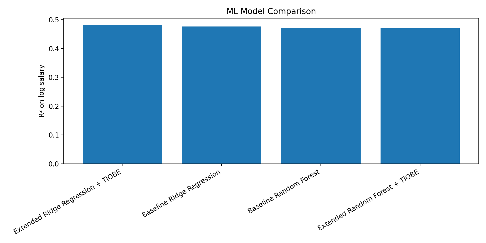
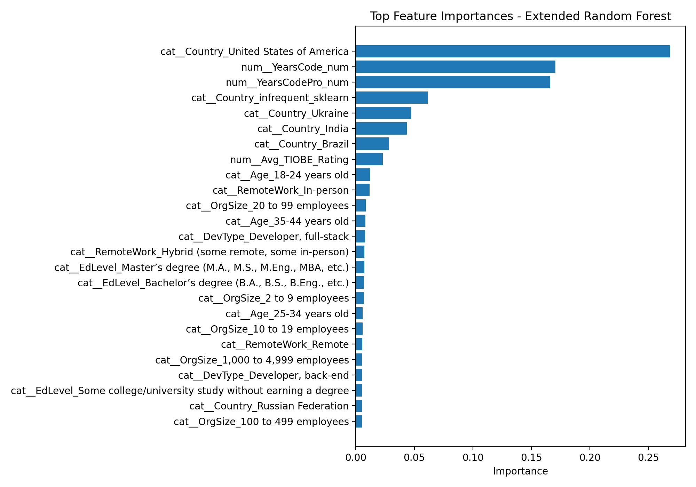

## A Data-Driven Analysis of Developer Salaries:  What Makes a Developer Earn More? 
---

## 1. Project Motivation

In today’s software industry, developers often question which skills and conditions lead to higher salaries. While some believe that choosing popular programming languages leads to better compensation, others argue that structural factors such as experience and work conditions are more important.

**The goal of this project is to move beyond intuition and analyze developer salaries using real-world data.** By building a full data science pipeline—from data collection and cleaning to statistical hypothesis testing—this project aims to uncover the key drivers behind salary differences.

---

## 2. Data Pipeline & Methodology

### 2.1 Data Sources

* **Stack Overflow Developer Survey 2024**
  → Provides individual-level data (salary, experience, languages, work type)

* **TIOBE Index 2024**
  → Provides external data on programming language popularity

### Processed Data

Due to GitHub file size limitations, sampled versions of the processed datasets are included in this repository.

Full processed datasets are available here:
https://drive.google.com/drive/folders/1eua8dMro7d876svTu6Q2K29K2r_s9xxO?usp=sharing
---

### 2.2 Data Cleaning & Preparation

To ensure reliable analysis, the dataset was carefully preprocessed:

* Filtered only **employed developers**
* Removed missing and invalid salary values
* Removed extreme outliers (1st–99th percentile)
* Converted experience into numeric format
* Applied **log transformation** to normalize salary distribution

---

### 2.3 Data Enrichment

To incorporate market-level information:

* Collected 12 months of TIOBE data
* Computed yearly average popularity scores
* Merged popularity data with developer-level dataset

This step allows us to analyze whether **language popularity affects salary**.

---

## 3. Exploratory Data Analysis (EDA)

### 3.1 Salary Distribution

*Objective: Understand how salaries are distributed.*


**Insights:**

* Salary distribution is highly **right-skewed**
* A small number of developers earn significantly higher salaries
* Log transformation improves interpretability

---

### 3.2 Experience vs Salary

*Objective: Examine relationship between experience and salary.*


**Insights:**

* Salary generally increases with experience
* However, there is high variance across all experience levels

---

### 3.3 Remote vs In-Person Work

*Objective: Compare salaries based on work modality.*


**Insights:**

* Remote and in-person work show clear differences in salary distribution
* Work modality appears to influence compensation

---

### 3.4 Programming Languages and Salary

*Objective: Compare salaries across languages.*


**Insights:**

* Some languages consistently have higher median salaries
* Language choice plays a significant role in earnings

---

### 3.5 Popularity vs Salary

*Objective: Analyze relationship between popularity and salary.*


**Insights:**

* No clear relationship between popularity and salary
* Some less popular languages still have high salaries

---

## 4. Statistical Hypothesis Testing

To validate the findings from exploratory data analysis, formal statistical tests were conducted.

---

### Test 1: Salary Differences Across Programming Languages (ANOVA)

- **Null Hypothesis ($H_0$):** There is no significant difference in mean salaries across programming languages.  
- **Alternative Hypothesis ($H_1$):** At least one programming language has a significantly different mean salary.  

- **Test Used:** One-way ANOVA  
- **Result:** p < 0.001  

**Conclusion:**  
The null hypothesis is rejected. Salaries differ significantly across programming languages, indicating that language choice is an important factor in salary determination.

---

### Test 2: Remote vs In-Person Work (Welch t-test)

- **Null Hypothesis ($H_0$):** There is no difference in mean salaries between remote and in-person workers.  
- **Alternative Hypothesis ($H_1$):** There is a significant difference in mean salaries between remote and in-person workers.  

- **Test Used:** Welch Two-Sample t-test  
- **Result:** p < 0.001  

**Conclusion:**  
The null hypothesis is rejected. Work modality (remote vs in-person) has a statistically significant impact on salary.

---

### Test 3: Programming Language Popularity vs Salary (Spearman Correlation)

- **Null Hypothesis ($H_0$):** There is no correlation between programming language popularity and salary.  
- **Alternative Hypothesis ($H_1$):** There is a significant correlation between programming language popularity and salary.  

- **Test Used:** Spearman Rank Correlation  
- **Correlation Coefficient:** -0.27  
- **p-value:** 0.26  

**Conclusion:**  
The null hypothesis cannot be rejected. There is no statistically significant relationship between programming language popularity and salary.

---

## 5. Machine Learning Models

To extend the statistical analysis, supervised machine learning models were applied to predict developers' yearly compensation.

The target variable was the log-transformed yearly compensation (`LogSalary`). Since salary values are highly right-skewed, predicting the logarithmic form of salary provides a more stable modeling target.

### 5.1 Modeling Strategy

Two model settings were compared:

**Baseline models:**  
The baseline models used only structural and demographic variables:

- Years of professional coding experience
- Total years of coding experience
- Age group
- Remote work status
- Education level
- Developer type
- Organization size
- Country

**Extended models:**  
The extended models added programming-language-related information:

- Main programming language
- Average TIOBE popularity rating
- Number of months the language appeared in the TIOBE index

This comparison was designed to test whether programming language popularity improves salary prediction after controlling for structural factors.

### 5.2 Models Used

The following models were trained and evaluated:

- Ridge Regression
- Random Forest Regressor

The models were evaluated using:

- Mean Absolute Error (MAE)
- Root Mean Squared Error (RMSE)
- R² score

Because the dataset was expanded by programming language, the same developer could appear in multiple rows. To avoid data leakage, the train-test split was performed using `ResponseId` as a group variable.

### 5.3 Model Performance

| Model | MAE log | RMSE log | R² log | MAE USD | RMSE USD |
|---|---:|---:|---:|---:|---:|
| Extended Ridge Regression + TIOBE | 0.554 | 0.875 | 0.481 | 29,946 | 46,477 |
| Baseline Ridge Regression | 0.555 | 0.879 | 0.476 | 29,989 | 46,420 |
| Baseline Random Forest | 0.565 | 0.883 | 0.472 | 30,235 | 45,899 |
| Extended Random Forest + TIOBE | 0.566 | 0.884 | 0.470 | 30,207 | 46,080 |



### 5.4 Feature Importance

The Random Forest feature importance results show that salary prediction is mostly driven by structural variables such as country and experience.



The top Random Forest features were:

| Feature | Importance |
|---|---:|
| Country: United States | 0.268 |
| Years of Coding Experience | 0.171 |
| Years of Professional Coding Experience | 0.166 |
| Country: Infrequent Categories | 0.062 |
| Country: Ukraine | 0.047 |
| Country: India | 0.044 |
| Country: Brazil | 0.028 |
| Average TIOBE Rating | 0.023 |
| Age: 18-24 years old | 0.012 |
| Remote Work: In-person | 0.012 |

### 5.5 Machine Learning Interpretation

The machine learning results show that the Extended Ridge Regression model achieved the best overall R² score on the log-transformed salary target. Its R² value increased from 0.476 in the baseline Ridge model to 0.481 after adding programming language and TIOBE popularity features.

Although this improvement is positive, the increase is relatively small. This suggests that programming language popularity contributes to salary prediction, but its marginal effect is limited when structural variables such as country, years of experience, education, organization size, and remote work status are already included.

The Random Forest feature importance results also support this interpretation. The strongest predictor was whether the developer was located in the United States, followed by total coding experience and professional coding experience. The TIOBE popularity rating appeared among the top features, but its importance was much lower than country and experience-related variables.

Overall, the ML findings support the main hypothesis of the project: developer salaries are influenced by programming language choice and popularity, but structural labor-market factors are more dominant in explaining salary formation.
---

### Overall Interpretation

The statistical results show that while programming language choice and work modality significantly influence salaries, programming language popularity does not have a meaningful effect. This suggests that structural factors play a more important role in salary determination than market popularity.

---

## 6. Key Findings

- Programming language choice has a significant impact on salary.
- Remote work is a significant factor in salary differences.
- Programming language popularity does not significantly affect salary in the statistical correlation test.
- The best-performing ML model was the Extended Ridge Regression model with TIOBE features.
- Adding language popularity slightly improved the Ridge Regression model, but the improvement was small.
- Random Forest feature importance showed that country and experience were stronger predictors than TIOBE popularity.

---

## 7. Interpretation

The results show that **structural factors**, such as experience and work conditions, play a much larger role in determining salary than programming language popularity.

Although popular languages dominate the market, they do not necessarily provide higher earnings.

This suggests that **real-world compensation is driven by demand, specialization, and context rather than popularity metrics alone.**

The machine learning results further support this interpretation. While TIOBE popularity provided a small improvement in the Ridge Regression model, the strongest predictive signals came from country and experience. Therefore, language popularity should be interpreted as a secondary factor rather than a primary driver of salary.

---

## 8. Project Structure

```
dsa210_salary_project/
│
├── Developer_Salary_Analysis.ipynb   # Main notebook for EDA and statistical analysis
├── ml_salary_models.ipynb            # Machine learning models and evaluation
├── src/                              # Python scripts (pipeline)
├── data/                             # Raw and processed datasets
├── outputs/                          # Generated figures and tables
├── requirements.txt
├── README.md
```

---

## 9. How to Run

1. Install dependencies:

```bash
pip install -r requirements.txt
```

2. Run the analysis:

```bash
python src/salary_analysis.py
```

3. Run the machine learning models:

```bash
python ml_salary_models.ipynb
```

4. Open the notebook:

```bash
jupyter notebook Developer_Salary_Analysis.ipynb
```

---

## 10. Outputs

All generated outputs are saved in:

```
outputs/figures/
outputs/tables/
```

---

## 11. Conclusion

This project demonstrates that developer salaries are shaped primarily by structural and contextual factors, rather than programming language popularity alone.

While programming language choice matters, popularity alone is not a reliable predictor of compensation. The machine learning results show that adding TIOBE popularity slightly improves the Ridge Regression model, but the strongest predictive factors are country and experience.

Overall, the results suggest that real-world compensation is driven more by labor-market context, experience, and specialization than by general popularity metrics.

---
---

## Academic Integrity

This project is an original work created for the course **DSA 210 – Introduction to Data Science** at Sabancı University.

All analysis, coding, and interpretations were conducted by the author. AI tools (such as large language models) were used only for assistance in debugging, code structuring, and improving clarity in written explanations, in accordance with Sabancı University’s academic integrity guidelines.

---

## Author

**Nil Kadakal**  
Sabancı University  
Computer Science and Engineering  

**Course:** DSA 210 – Introduction to Data Science  
**Term:** Spring 2025–2026  

---

## Project Status

**Completed:**
- Data Collection
- Data Cleaning & Preprocessing
- Data Enrichment (TIOBE Index Integration)
- Exploratory Data Analysis (EDA)
- Statistical Hypothesis Testing
- Machine Learning Modeling
- Baseline vs Extended Model Comparison
- Random Forest Feature Importance Analysis
- Results Interpretation  

---

## Last Updated

May 2026

*This project was conducted for the Sabancı University DSA210 course.*
